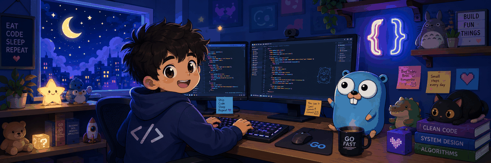

  

<h1 align="center">Hi 👋, I'm Abhijit Roy</h1>

<h3 align="center">
  Backend Developer | Golang | Distributed Systems | WebSockets | Redis | Docker | AWS
</h3>

  

---

## 🧒 About Me

I am a backend developer who enjoys building systems that actually do things.

I like working with **Go**, **WebSockets**, **Redis**, **async workers**, **Docker**, **Nginx**, and backend-heavy projects.

Sometimes I code at night.  
Sometimes I sleep during the day.  
The gopher understands.

---

## 🛠️ Tech Stack

  

---

## 🚀 Featured Projects

### 🛰️ NebulaLink

Distributed agent-master system for real-time communication and file watching.

**Tech:** Go, WebSocket, SSE, fsnotify, Docker, Linux, Windows Services

- WebSocket-based agent communication
- SSE updates for frontend clients
- Recursive file watcher
- Cross-platform service handling
- Log rotation and connection lifecycle management

---

### 🎲 Snakes & Ladders Multiplayer

Real-time multiplayer game backend with matchmaking and WebSocket rooms.

**Tech:** Go, WebSocket, Redis, Docker, Nginx

- Matchmaking flow
- Room-based WebSocket communication
- Game state management
- Turn-based engine
- Backend deployment with Nginx reverse proxy

---

### 🏦 Banking FD/RD Async Backend

Backend system for asynchronous FD/RD request processing.

**Tech:** Go, Redis, MySQL, Asynq, Worker Pools, Prometheus, Grafana

- Maker-checker workflow
- Async request queue
- Redis-backed sessions
- Worker-based processing
- Observability and performance monitoring

---

## 🧩 Coding Profiles

  

  

  

---

## 🌐 Connect With Me

  

  

---

  <b>Eat. Code. Sleep. Repeat.</b>

